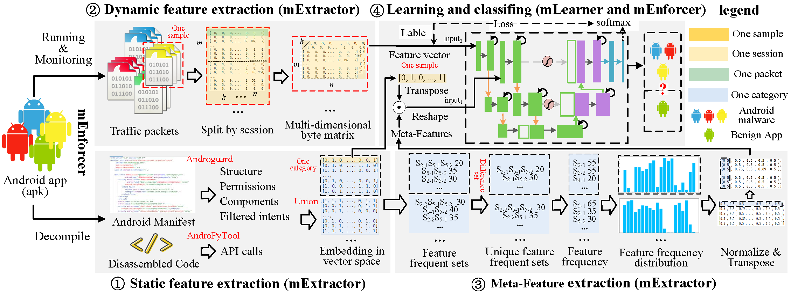

# metaNet, an interpretable unknown malware identification method with a novel meta-features mining algorithm
This project is the supporting material of the paper titled "metaNet: Interpretable Unknown Mobile Malware Identification with a Novel Meta-features Mining Algorithm", including: dataset, test results, source code, etc.

# Folder introduction

## Virustotal
The folder "Virustotal" includes the detection results of tools on virustotal.

## KFeatures
The folder "KFeatures" illustrates the first K-dimensional features we used.

## Code
The folder "Code" includes part of the source code of metaNet and its installation and usage tutorials. We promise to disclose all the source code when the paper is accepted.

## DApps

The folder "DApps" includes the DApp experiment files such as the traffic dataset and feature extraction script.

## examples

The folder "examples" describes the distinctive features of other malware categories.
