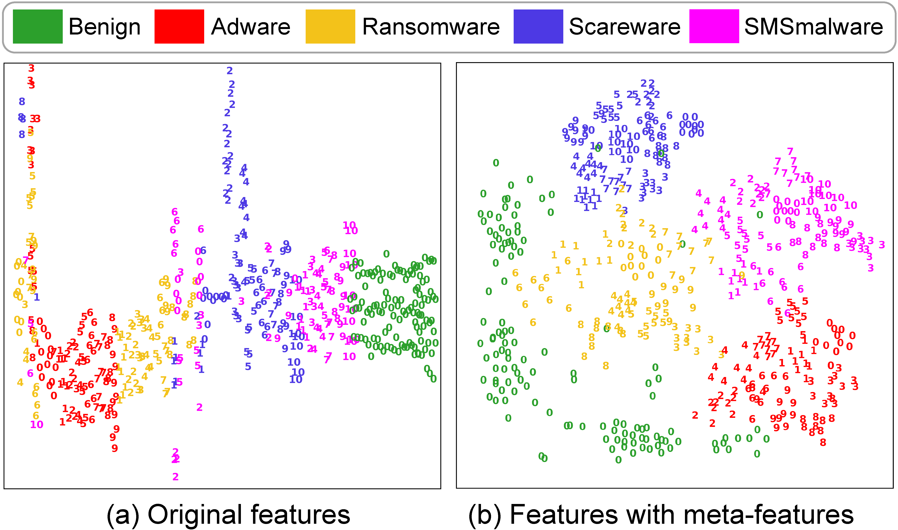
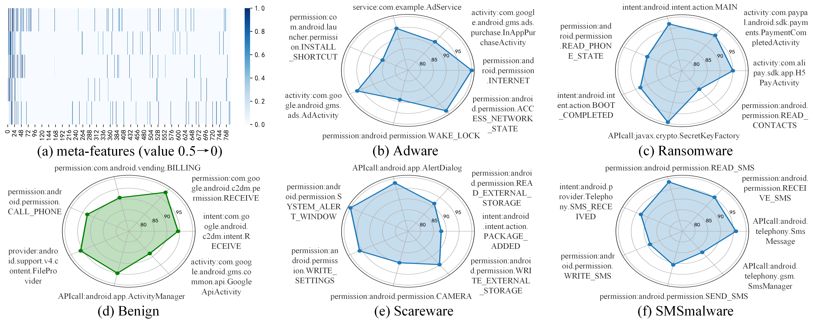

# Further Analysis for Meta-features

## The effectiveness for sample distribution

we employ t-SNE to visualize the anterior and posterior sample distribution processed by meta-features, as shown in Fig. 8. It demonstrates that the obvious aggregation of samples in the same family, e.g., clustered blue numbers 2 represent the fakeApp family. That is, the same family tends to have similar distributions of features, which is the key to identifying them as a family. The above sub-figure (a) shows the distribution of the original sample, where there are families with different distributions in the same category. For instance, the pink numbers 6 and 10 represent the Fakemart and Plankton families, respectively. They are both belong to the SMSmalware category, while having an inconsistent distribution. When Plankton acts as an unknown family, it will confuse SOTAs' classifiers and lead to their misidentification. In contrast, The sub-figure (b) depicts the distribution of samples after processing with meta-features. The different families of the same category are clustered together and various categories are separated from each other. For instance, the pink numbers 6 and 10 are more closely distributed than in the sub-figure (a). This stems from the salient family features excavated by meta-features amplifying the originally weak family connection, so that different families can be further closely related.

## The reliability for distinctive features

In order to illustrate the correctness of meta-features, we visualized the content of meta-features to elucidate the salient features of each category, as depicted in the above figure. Among them, sub-figures (b)~(f) show the highlighted features and their importance from the sub-figure (a). The examples are detailed as follows to explain these valuable insights.

- **Adware malware** often requires *INTERNE*T and *ACCESS_NETWORK_STATE* permissions to download and display optimal ads. Meanwhile, it may display ads within the app through Google AdMob (*gms.ads.AdActivity*) and handle ad-related tasks using the *com.example.AdService*, such as downloading the contents of ads in the background. Even more, it might utilize the *WAKE_LOCK* permission to keep the app awake when the device is in sleep mode, ensuring that ads can be displayed as scheduled.
- Most **SMS malware** attempts to trick users through deceptive SMS content. During this process, they require permissions such as *RECEIVE_SMS*, *READ_SMS*, *WRITE_SMS*, and *SEND_SMS* to receive, read, write, and send SMS messages. Also, they will invoke the *SmsMessage* API to send messages and execute malicious operations upon receiving SMS through the *SMS_RECEIVED* intent, such as retrieving victim information from the device.
- **Ransomware malware** mainly extorts victims to pay ransom by encrypting files with the *javax.crypto.SecretKeyFactory*. During this process, it often embeds malicious code at *intent.action.MAIN* of the application, and execute activities like *H5PayActivity* and *PaymentCompletedActivity* to guide users in making ransom payments. Additionally, it usually activates the ransomware after the device reboots through the *BOOT_COMPLETED*, and requires the *READ_PHONE_STATE* permission to access device information for contacting victims.
- **Scareware** malware often intimidates users by invoking the *AlertDialog* API to open a dialog box to display threatening or deceptive information. During this process, it usually applies for the *SYSTEM_ALERT_WINDOW* permission to allow the window to be displayed on top of other applications, thus enforcing the display of malicious content. Additionally, it employs the *WRITE_EXTERNAL_STORAGE* and *READ_EXTERNAL_STORAGE* permissions to write/read threatening information to/from external storage, so that it can display this intimidating content persistently. Furthermore, it may deceive users into installing fake security tools to address the alarms through the *PACKAGE_ADDED* intent. Meanwhile, they will write malicious operations into the system settings using the *WRITE_SETTINGS* permission. In some cases, they may even request the *CAMERA* permission to take photos or videos of users for intimidation purposes.
- Unlike malicious software, **benign Android applications** perform the routine operations of users through common permissions and API calls. For instance, they manage files through *FileProvider* and run activities through *ActivityManager*. Additionally, Google applications often use *GoogleApiActivity* for interactions with Google, and employ the *c2dm.permission.RECEIVE* permission to receive Google Cloud Messages. Besides, benign applications usually make phone calls and regular shopping by requiring *CALL_PHONE* and *vending.BILLING permissions*.

However, despite these shared characteristics among various families in the same class, their global features may be different from others given their distinct behaviors. For instance, as shown in the first figure of this page, Fakemart and Plankton, both belonging to the SMSmalware category, exhibit different feature distributions. This can be attributed to the fact that Fakemart deceives users into downloading fake applications by sending SMS messages with fraudulent App market links. Differently, Plankton steals device information through a backdoor and transmits it to servers via SMS. In this way, the unknown families tend to hold too many misleading features, which may confuse classifiers and make them misclassified. In contrast, concentrating on salient features of categories through meta-features enables them to detect samples of known and unknown families more accurately. In total, the above conclusions about meta-features of malware are consistent with reality, which can demonstrate the correctness of meta-features.